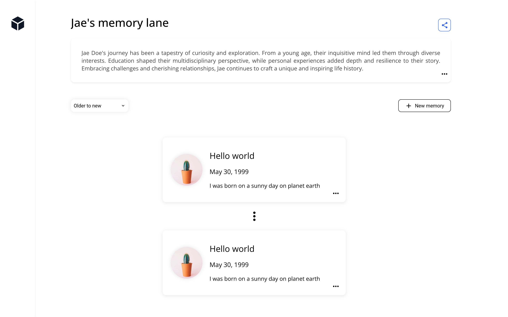

# Desafio de Codificação: memory lane

**Por favor, evite iniciar pull requests neste repositório ou fazer fork deste repositório. Para enviar sua solução, configure um repositório em sua própria conta ou encaminhe um arquivo zip para o contato apropriado dentro de nosso time.**

### Definição do Problema

Após uma série de brainstorms, descobrimos um problema que nossos usuários estão enfrentando. Eles estão tendo dificuldade em compartilhar suas memórias com amigos e familiares. Eles estão usando uma combinação de redes sociais, aplicativos de mensagens e e-mail para compartilhar suas memórias. Eles estão procurando uma solução que permita armazenar e compartilhar suas memórias em um único lugar.

Como uma primeira iteração para esta solução, queremos construir uma aplicação web que permita aos usuários criar uma timeline e compartilhá-la com amigos e familiares. Essa timline é uma coleção de eventos que aconteceram em ordem cronológica. Cada evento consiste em um título, uma descrição, um timestamp e pelo menos uma imagem.

## Entregáveis

- Um README atualizado fornecendo uma explicação de alto nível de sua implementação.
- **Capturas de tela ou um vídeo/gif curto** mostrando sua implementação de UI.
- Atualize a API para acomodar seu design. Execute a API usando `npm run serve:api`.
- O mockup fornecido é apenas para referência e inspiração. Sinta-se à vontade para melhorá-lo!

### FAQ

- **Posso adicionar um framework como Next?** Se você tiver tempo, vá em frente, queremos ver você usar suas ferramentas favoritas.
- **A autenticação do usuário é necessária?** Não, não é necessária.
- **Posso usar uma biblioteca de componentes?** Sim, você pode usar uma biblioteca de componentes.
- **O que vocês estarão procurando?** Boa experiência do usuário, código reutilizável e um design técnico bem pensado.

### Mockup de Inspiração

